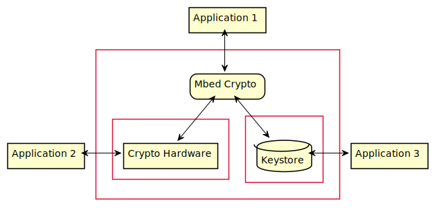

# Mbed Crypto Threat Model

This document describes the security guarantees of the Mbed Crypto library,
enabling developers to understand the security threats the library expects to
mitigate. The document considers both the legacy Mbed TLS Crypto API and the
reference implementation the PSA Crypto API.

Cryptography traditionally takes an attacker centric view of threat modeling.
This seems to be the most natural approach for Mbed Crypto too. However, we
are going to provide software and asset centric models as well. This will
provide more complete view for threat modeling.

## Data Flow Diagram

Mbed Crypto is a library and might be deployed in a variety of conditions.

Sometimes the library might or might not run in the same process as the
application. They might run on different exception\privilege levels or security
states. In some cases maybe even on separate cores or processors.

If the the calling application and Mbed Crypto are not running in the same
process, there is an IPC mechanism present to connect the two. In this case
there could potentially be several applications using the same Mbed Crypto
instance simultaneously.

Either way, the library potentially serves several applications and as a
cryptography library it lies at the heart of the wider system's security.
Therefore we will treat the calling application as less trusted. (Knowing that
in case they share a process, there is very little that can be done about it.)

Mbed Crypto allows for use of hardware accelerators and secure elements (Crypto
Hardware) both by the legacy replacement API and the new PSA Crypto Driver
Model. Both hardware accelerators and secure elements perform cryptographic
operations. The latter additionally store keys as well.

Both of these play a very similar role in the system as the library itself:
they perform cryptographic operations. Therefore it makes sense to model them
with a trust level at least as high as that of the library.

The cryptographic hardware in the scope of this model can be many things. For
example it can be a separate device like a HSM or a smart card.  Or it can be a
cryptoprocessor, which might or might not be on the same die as the main CPU.
Alternatively it can just be extended functionality of the main CPU or
technically maybe even just an alternative software implementation.

The PSA Crypto API has the concept of persistent keys. These keys are not
provided directly by the application and are usually not even visible to
them. To implement this, the library needs access to a keystore. Since this
component holds cryptographic keys it makes sense to model it with a trust
level at least as high as that of the library.

The keystore might be implemented in several different ways too. It can for
example be a secure non-volatile memory (eg. on-chip flash), some secure
storage service, encrypted files or perhaps files protected by plain OS access
control.

In an ideal case cryptographic hardware and the keystore are used exclusively
by Mbed Crypto. In practice however they both might potentially be used by
any number of other applications as well.

## Attackers

### Attacker Capabilities

We classify the attackers based on their capabilities as follows:
- **Software-Only (SO):** Attackers who can run arbitrary code at their level of privilege.
- **Low-Resolution-Side-Channel (LRSC):** Attackers who have access to low-resolution software-accessible sensors (e.g.  cache timing, audio).
- **Non-Invasive-Physical (NIP):** Attackers who have the resources and sufficient physical access to the device to use common hardware for attacks that do not require irreversible/detectable changes to the target system (e.g. JTAG debugging, bus interception, SPA, DPA, SEMA, DEMA).
- **Invasive-Physical (IP):** Attackers who are able to use specialist hardware for attacks that require irreversible changes to the target system (e.g. “rewiring” a chip using a Focused Ion Beam (FIB) workstation)
- **Software-Fault-Injection (SFI):** Attackers who can inject faults using software-only means (e.g. row hammer
attack).
- **Hardware-Fault-Injection (HFI):** Attackers who have the equipment and physical access to induce faults using physical means to take control of a device (e.g., power or clock glitches, light).

### Attacker Enumeration

| Attacker | Capability Level | Description |
| -------- | ---------------- | ----------- |
| AT-CRY   | SO       | Compromised application with legitimate access to Mbed Crypto         |
| AT-STR   | SO       | Compromised application with legitimate access to the keystore        |
| AT-CHW   | SO       | Compromised application with legitimate access to the crypto hardware |
| AT-LOC   | LRSC     | Compromised application running on the same platform as Mbed Crypto   |
| AT-PHY   | NIP      | Attacker with physical access to the device running Mbed Crypto       |

Mbed Crypto at present is very far away from offering any tangible protection
against attackers with SFI, HFI or IP capabilities. Such attackers are therefore
out of scope for this investigation. If threats presented by SFI, HFI or IP
attackers is a concern, they must be mitigated at system level.

## Assets

The main assets Mbed Crypto handles are cryptographic keys and plaintext
messages.

| Prefix | Description |
| ------ | ----------- |
| AS-PT- | Plaintext   |
| AS-PK- | Public key  |
| AS-SK- | Private or secret key or password |

The different cryptographic algorithms implemented in Mbed Crypto might need
different mitigations in place to protect them from threats. Therefore it makes
sense to differentiate assets based on the algorithms or schemes involved.

To qualify the asset name, we use the corresponding algorithm name in full
capitals as a postfix. For example:

| Asset | Description |
| ----- | ----------- |
| AS-PT-SHA2      | Plaintext hashed with one of the SHA-2 algorithms  |
| AS-PT-DH        | Shared secret generated during ECDH key exchange |
| AS-PK-RSA-PSS   | Public key used in the RSA-PSS signature algorithm  |
| AS-SK-PBKDF     | Password used in a PKCS5 key derivation scheme |
| AS-SK-AES-CCM   | Secret key used in AES-CCM authenticated encryption |
| AS-SK-ECDSA     | Private key used in ECDSA signature |
| ...    | |

To make referring to several corresponding assets easier, we will use
wildcards. For example:

| Asset | Description |
| ----- | ----------- |
| AS-\*-ECDSA     | Plaintext, public and private key involved in ECDSA |
| AS-PT-AES-\*    | Plaintext involved in any AES based algorithm |
| AS-PK-\*        | Public key in any algorithm |
| ...    | |
